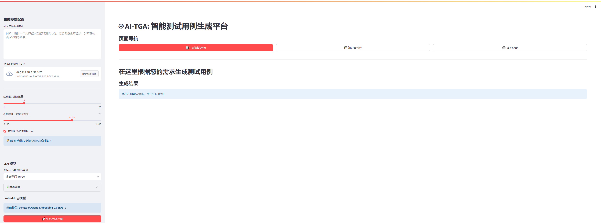
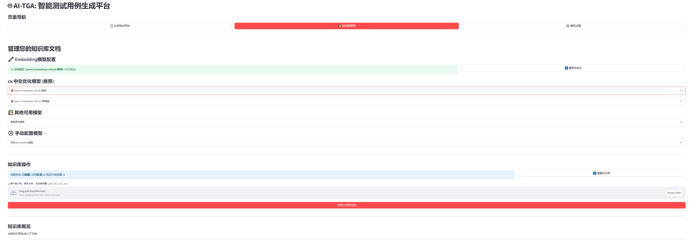
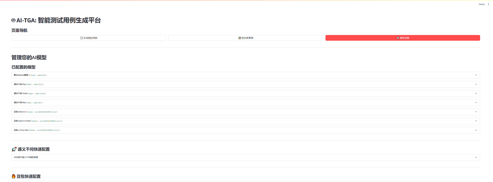

# AI-TGA: 智能测试用例生成平台

这是一个使用大型语言模型（LLM）来智能生成软件测试用例的平台。

## ✨ 主要功能

- **多种生成模式**: 
  - **LLM 直接生成**: 直接使用大型语言模型根据您的需求生成测试用例。
  - **RAG 增强生成**: 结合检索增强生成（RAG）技术，利用您提供的知识库文档，生成更贴合实际业务场景的测试用例。
  - **RAG + Think 模式**: 在RAG的基础上，利用Qwen3系列模型的"Think"功能，展示模型的思考过程，提高生成结果的逻辑性和透明度。
- **模型支持**: 支持多种本地和远程模型，包括 Ollama、OpenAI、Gemini、Qwen、Doubao等。
- **动态批处理**: 根据不同模型的上下文窗口大小和性能，智能调整生成批次，最大化效率。
- **文件上传**: 支持上传需求文档、产品介绍等文件作为知识库，用于RAG增强生成。
- **结果导出**: 支持将生成的测试用例导出为Excel或CSV格式。

## 🚀 安装与运行

1.  **克隆项目**
    ```bash
    git clone <your-repository-url>
    cd ai_test_case_agent
    ```

2.  **安装依赖**
    请确保您已安装 Python 3.8+。然后运行以下命令安装所需库：
    ```bash
    pip install -r requirements.txt
    ```

3.  **配置模型**
    - 在 `config.json` 文件中配置您需要使用的本地或云端LLM和Embedding模型。
    - 如果使用Ollama，请确保Ollama服务正在运行。

4.  **运行应用**
    使用Streamlit启动应用：
    ```bash
    streamlit run app.py
    ```

## 📖 使用说明

1.  **启动应用**后，在浏览器中打开显示的本地URL（默认为 `http://localhost:8501`）。
2.  **配置生成参数**: 在左侧边栏中，您可以：
    - 输入生成需求。
    - 上传知识库文件（可选，用于RAG模式）。
    - 设置生成用例的数量、温度等参数。
    - 选择生成模式（LLM / RAG）。
    - 选择要使用的LLM和Embedding模型。
3.  **开始生成**: 点击“生成测试用例”按钮。
4.  **查看结果**: 生成的测试用例将显示在主界面表格中。
5.  **导出数据**: 您可以将结果导出为多种格式的文件。

## 📝 功能指南

- 关于 **Think 功能** 的详细介绍，请参考 <mcfile name="THINK_FEATURE_GUIDE.md" path="d:\Desktop\ai_test_case_agent\THINK_FEATURE_GUIDE.md"></mcfile>。

## 效果图





